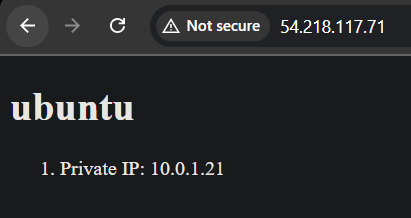

# 4640-w10-lab-start-w25

## Results
**Victory Screenshot**



## General Setup
1. **Clone the repository** to your local machine.
2. **Ensure you have the following installed and setup**:
    - Install [Terraform](https://developer.hashicorp.com/terraform/tutorials/aws-get-started/install-cli).
    - Install AWS CLI
    - Connect to AWS derver with `aws configure` with your Access Key ID and Secret Access Key. 

## STEPS
1. **Generate a new SSH key pair**
    ```bash
    ssh-keygen -t ed25519 -f ~/.ssh/aws
    ```
2. **Import the key to AWS**
    - Open project repo
    - Run
    ```bash
    ./scripts/import_lab_key $HOME/.ssh/aws.pub
    ```
3. **Run Terraform**
    ```bash
    terraform -chdir=./terraform init
    terraform -chdir=./terraform apply --auto-approve
    ```

## Clean up
1. **Terminate instances**
    ```bash
    terraform -chdir=./terraform destroy --auto-approve
    ```
2. **Delete SSH Key**
    ```bash
    ./scripts/delete_lab_key
    rm $HOME/.ssh/aws
    rm $HOME/.ssh/aws.pub
    ```
3. **Delete AMI**
    1. Log in to AWS
    2. Navigate to AMI under EC2
    3. Deregister the AMI with the name "packer-ansible-nginx"
4. **Delete Snapshots**
    1. Log in to AWS
    2. Navigate to Snapshot under EC2
    3. Delete the snapshots created recently

## Note
- You can run this command to apply changes to the instances if you modify any files in the Ansible folder after executing terraform apply.
    - The `--flush-cache` option is needed to resolve any cache conflicts
```
ansible-playbook -i ./inventory/aws_ec2.yml  playbook.yml --flush-cache
```
